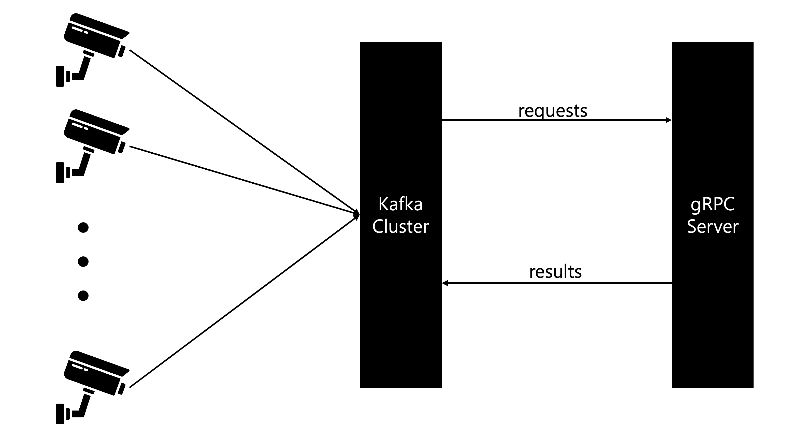
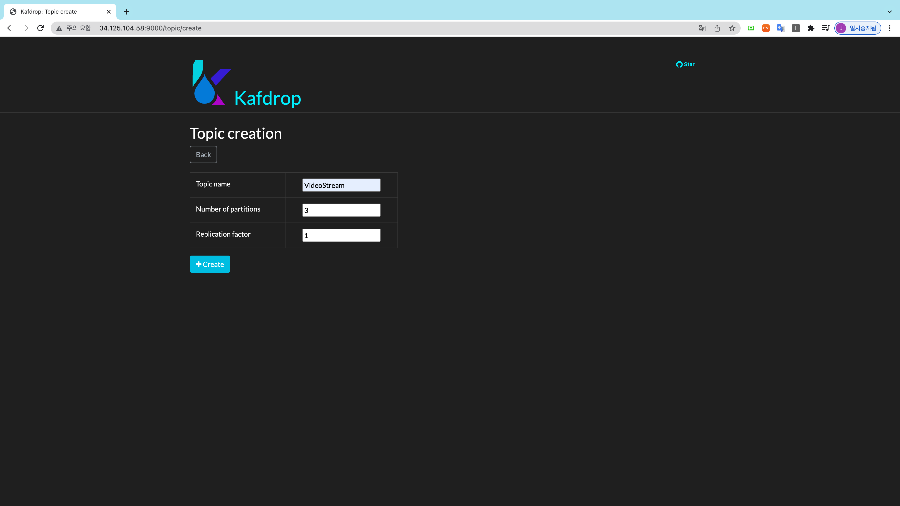

## Multi-Video-Stream-Processing-with-ML

### Architecture
다수의 엣지 디바이스에서 스트리밍 형태로 데이터를 받아오게 되면, 카프카 클러스터는 이를 받아 와서 gRPC서버로 inference요청을 보내고, 결과를 다시 카프카 클러스터의 다른 토픽으로 저장하는 구조.

### Usage
1. 카프카 클러스터 실행
~~~
docker-compose up
~~~

2. Topic 생성
http://localhost:9000 으로 접속한 후 아래 그림과 같이 VideoStream, ResultStream 토픽을 생성

3. Producer 실행
비디오 파일을 읽은 후에 스트림을 생성하여 카프카 클러스터로 이벤트를 전달하는 producer를 실행
~~~
python producer.py
~~~

4. gRPC 서버 실행
gRPC 서버를 실행하여 호출 시 결과를 반환할 수 있도록 함.
~~~
python grpc_server/server.py
~~~

5. Consumer실행
카프카 클러스터로부터 비디오 스트림 데이터를 가져와서 grpc로 호출을 보내고 받은 데이터를 다시 ResultStream 토픽으로 결과를 노출함.
~~~
python consumer.py
~~~